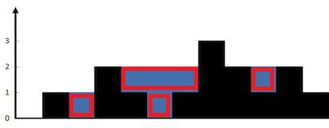
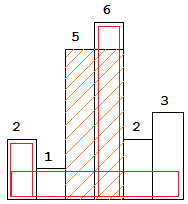

# 单调栈

单调栈是一种特殊的栈，可以用来维护某种逻辑信息，在很多题目中非常有效。
这是一种数据结构，所以它通常服务于题目的解法。也就是说，我们需要先分析题意，设计出某种解法，然后要自行判断是否需要单调栈这种数据结构。

下面三道题目很适合用视频或者动态gif图来讲解，文字确实有点干瘪。

## 接雨水
> 详情参考 [LeetCode 42](https://leetcode-cn.com/problems/trapping-rain-water/)

**题目描述**: 给定 n 个非负整数表示每个宽度为 1 的柱子的高度图，计算按此排列的柱子，下雨之后能接多少雨水。

**示例**:
```
输入: [0,1,0,2,1,0,1,3,2,1,2,1]
输出: 6
```



**题解**：这里需要一个单调减栈，遇到比栈顶高的柱子，说明可以前面有柱子可以存雨水, 我们就要进入雨水的计算。
计算雨水的核心是把雨水如图分成4个矩形.

参考代码：
```cpp
class Solution {
public:
    int trap(vector<int>& height) {
        if(height.empty()) return 0;
        int n = height.size(), cnt = 0;
        stack<int> s;
        for(int i = 0; i < n; ++i) {
            int h = height[i];
            while(!s.empty() && height[s.top()] < h) {
                int j = s.top(); s.pop();
                if(!s.empty()) {
                    int distance = i - s.top() - 1;
                    int delta_h = min(height[s.top()], h) - height[j];
                    cnt += distance * delta_h;
                }
            }
            s.push(i);
        }
        return cnt;
    }
};
```

## 柱状图中的最大矩形
> 详情参考[LeetCode 84](https://leetcode-cn.com/problems/largest-rectangle-in-histogram/)

**题目描述**：给定 n 个非负整数，用来表示柱状图中各个柱子的高度。每个柱子彼此相邻，且宽度为 1。求在该柱状图中，能够勾勒出来的矩形的最大面积。

**示例**：
```
输入: [2,1,5,6,2,3]
输出: 10
```



**题解**：这个单调递增栈也不难，遇到比栈顶低的柱子，就要进入矩形面积的计算。这道题的关键在于理清楚如何求矩形面积。

```cpp
class Solution {
public:
    int largestRectangleArea(vector<int>& heights) {
        if(heights.empty()) return false;
        stack<int> s;
        heights.push_back(0);
        int n = heights.size(), max_area = 0;
        for(int current_i = 0; current_i < n; ++current_i) {
            int current_h = heights[current_i];
            while(!s.empty() && heights[s.top()] > current_h) {
                int top_i = s.top(); s.pop();
                int distance = (s.empty())? current_i: current_i-s.top()-1;
                int area = heights[top_i] * distance;
                max_area = max(max_area, area);
            }
            s.push(current_i);
        }
        return max_area;
    }
};
```

## 最大矩形
> 详情参考[LeetCode 85](https://leetcode-cn.com/problems/maximal-rectangle/)

**题目描述**：给定一个仅包含 0 和 1 的二维二进制矩阵，找出只包含 1 的最大矩形，并返回其面积。

**示例**：
```
输入:
[
  ["1","0","1","0","0"],
  ["1","0","1","1","1"],
  ["1","1","1","1","1"],
  ["1","0","0","1","0"]
]
输出: 6
```

**分析**：这个是柱状图最大矩形的扩展, 上面的矩阵对应：
```
[
  ["1","0","1","0","0"],
  ["2","0","2","1","1"],
  ["3","1","3","2","2"],
  ["4","0","0","3","0"]
]
```
这个矩形每一行都是一个柱状体。

参考代码：
```cpp
class Solution {
public:
    int maximalRectangle(vector<vector<char>>& matrix) {
        if(matrix.empty()) return 0;
        int n = matrix[0].size(), rst = 0;
        vector<int> heights(n, 0);
        for(int i = 0; i < matrix.size(); ++i) {
            for(int j = 0; j < n; ++j) {
                if(matrix[i][j] == '1') {
                    heights[j]++;
                }
                else {
                    heights[j] = 0;
                }
            }
            rst = max(rst, maxMatrix(heights));
        }
        return rst;
    }
private:
    int maxMatrix(vector<int>& heights) {
        if(heights.empty()) return 0;
        stack<int> s;
        heights.push_back(0);
        int n = heights.size(), rst = 0;
        for(int i = 0; i < n; ++i) {
            int hi = heights[i];
            while(!s.empty() && heights[s.top()] > hi) {
                int j = s.top(); s.pop();
                int distance = (s.empty())? i : i - s.top() - 1;
                rst = max(rst, distance * heights[j]);
            }
            s.push(i);
        }
        return rst;
    }
};
```