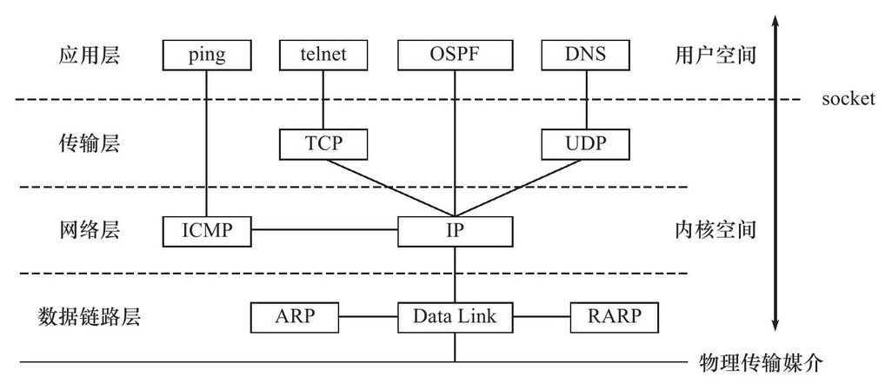
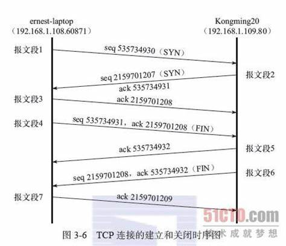
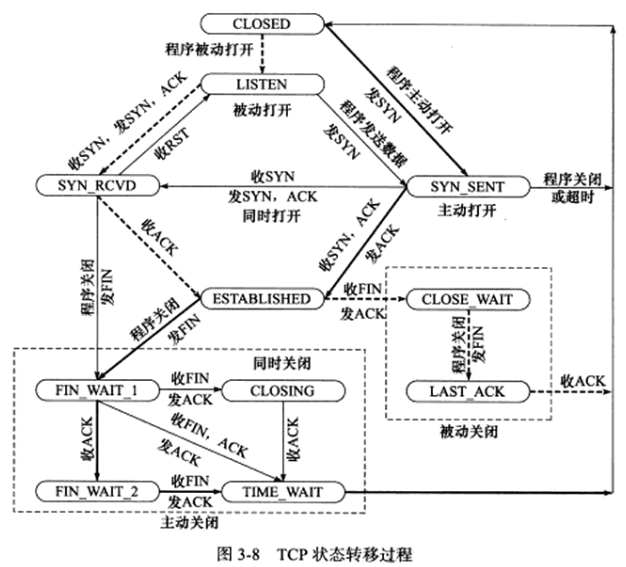
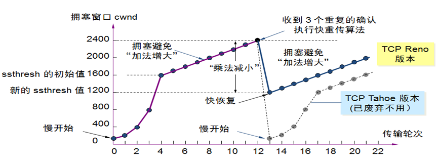

# 计算机网络

最近我在看网上的各种面试分享，其中列出问题都好难呀。身为一个计算机专业的学生，我甚是羞耻，
所以我决定把这些东西补齐。我刚刚开始看《Linux高性能服务器编程》和《Linux网络编程》，
其中 有些章节非常适合做成笔记。我还打算从网上找一些面试题，面试题涉及的知识点应该是非常
经典和重要的。

## TCP/IP 协议族

首先就是一张非常重要的协议族体系结构了，它由四层协议层组成：数据链路层、网络层、传输层和
应用层。



- 数据链路层：网卡接口的驱动程序、ARP协议（Address Resolve Protocal, 地址解析协议) 和
  RARP协议（Reverse Address Resolve Protocal, 逆地址解析协议），主要是用于ip和MAC
  （Media Address Control Address）转化。
- 网络层：数据包的选路与转发。形成WAN和LAN的层。核心协议IP（Internet Protocal）和 
  ICMP（Internet Control Message Protocal）。从上图可知，ICMP是基于IP的。
- 传输层：只关心通信的两端，中间环节由网络层负责。主要协议是TCP、UDP和SCTP。
- 应用层：ping、DNS服务都是属于这一层的。

## IP协议详解

IP协议是socket网络编程的基础了，所以还是需要搞明白的。IP协议的关键就是两点：头部信息
和路由转发过程。 IP协议是无连接、无状态和不可靠的。

### IP 头部信息

我们先来整一波IP协议的头部信息。

```
|4位版本号|4位头部长度|8位服务类型（TOS）|       16位总长度（字节数）     |
|            16位标识符                |3位标志|      13位片偏移        |
| 8位生存时间（TTL） |   8位协议        |        16位头部检验和          |
|                          32位源端IP地址                              |
|                          32位目的端IP地址                            |
|                         选项最多40字节                               |
```

- 4位版本号：ipv4还是ipv6；
- 4位头部长度；
- 8位服务类型：3位优先权字段（已忽略），4位TOS(Type of service)字段，1位保留字段为0；
  最小时延、最大吞吐量、最高可靠性和最小费用，只有一个能放置1；
- 16位总长度：IP数据报总长度；
- 16位标识符：数据包标识，所有分片是同一个标识符；
- 3位标志：|保留|禁止分片|后面还有分片|；
- 13位分片偏移；
- 8位生存时间：TTL（Time to live)，通常初始值为64；
- 8位协议：ICMP为1，TCP为6，UDP为17；
- 16位头部检验和；
- 32位源端IP地址；
- 32位目的端IP地址。

### IP分片

IP数据报长度不能超过MTU，所以每个IP数据报能包含的数据部分长度最长位1480，所以要分片。

### IP路由和转发

检查是否发给本机，如果是就转入传输层处理，如果不是就进入转发，根据路由机制进行转发，这
就涉及到路由表route和路由表更新策略，使用ICMP重定向报文更新。

## TCP协议详解

和UDP相比，TCP具有面向连接、字节流和可靠运输的特点。面向连接指的是双方必须建立好连接之后
才能传输数据；TCP通信双方发送和接受的信息都会先进入缓存区，应用程序可随时按照自己的需求
读写，双方的读写次数没有固定的关系，所以是字节流；TCP使用了发送应答机制和超时重传机制，
保证了传输的可靠性。因为TCP是 面向连接的，所以对广播和多播不友好，对于视频直播我们通常
使用UDP。

TCP协议核心知识分为如下四个部分：

- TCP头部信息；
- TCP状态转移过程；
- TCP数据流；
- TCP数据流的控制：超时重传与拥塞控制。

### TCP头部信息

同样的，我们研究一下TCP的头部信息。

```
| 16位源端口号                                            | 16位目的端口号|
|                             32位序号                                   |
|                            32位确认号码                                |
| 4位头部长度 | 6位保留 | URG | ACK | PSH | RST | SYN | FIN | 16位窗口大小 |
|                  16位校验和                              | 16位紧急指针 |
|                            选项，最多40字节                             |  
```

- 端口号告知主机该报文段来自哪个上层协议或应用程序，可以在 `/etc/services` 文件中查找；
- 32 位序列号表示TCP报文段在实际整个连接中的字节序号，首先随机生成一个ISN（Initial 
  Sequence Number），如果已经发送了1024个字节，那么下一个报文的序列号为 ISN + 1025；
- 32 位确认号，对另一方发送来的TDCP报文段的响应，对收到的TCP报文段的序号值加1;
- 4位头部长度表示TCP头部有多少个32bit，最长的是60字节；
- 6位标志位如下：URG表示紧急指针是否有效；ACK表示确认号是否有效；PSH提示接收端立即读取
  数据；RST表示要求对方重新建立连接；SYN表示请求建立连接；FIN表示通知关闭连接。
- 16位窗口大小：TCP流量控制的手段，告诉对方自己的TCP接受缓冲区还容纳多少字节；
- 16位校验和；
- 16位紧急指针：表示发送端将有紧急数据发送，对应的序列号是当前序列号加紧急指针的和。

### TCP的三次握手与四次结束



这里值得注意的是报文段5之后TCP连接进入半关闭阶段，Kongming20可以继续发送报文段，虽然在
实际应用程序中很少见。

### TCP状态转移总图

这张图通常我直接忽略了，但是我发现很多知识点都浓缩在这张图里了。



- 服务器通过listen系统调用被动等待客户端连接，所以会是被动打开；
- 客户端发送连接请求，进入 `SYN_SENT` 状态；
- 服务器收到连接请求，项客户端发送SYN标志的确认报文，此时连接处于 `SYN_RCYD` 状态；
- 客户端收到第二次确认报文、服务器成功接受客户端发回的第三次握手报文，双方进入 
  `ESTABLISHED` 状态；
- 客户端主动关闭连接时，发送结束报文段，同时进入`CLOSE_WAIT_1`状态；当收到客户端的确认
  报文，进入`CLOSE_WAIT_2`状态，此时服务端处于`CLOSE_WAIT`状态，TCP连接半关闭。
- 当客户端收到服务端的结束报文段时，回复ACK报文段，同时进入`TIME_WAIT`状态。
  
`TIME_WAIT` 状态存在有两点原因：

- 防止迟来的TCP报文段被丢弃;
- 保证迟来的TCP报文段有足够的时间被识别丢弃（防止使用相同的端口的新的TCP连接读取旧的报
  文段）；
  
客户端通常要等待 2MSL(Maximum Segment Life, 报文段最大生存时间)，标准文档RFC 1122的
建议值是2分钟。

### 超时重传与拥塞控制

首先超时重传策略会随着重传次数的增加，等待时间也会变长。

而TCP的拥塞控制就是一个直觉性的经验性的算法，通常被称为四个阶段：慢启动、拥塞避免、
快速重传和快速恢复。具体过程用一张图就可以概括：


